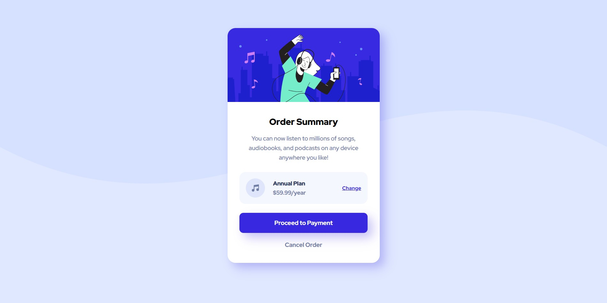

# Frontend Mentor - Order summary card solution

This is a solution to the [Order summary card challenge on Frontend Mentor](https://www.frontendmentor.io/challenges/order-summary-component-QlPmajDUj). Frontend Mentor challenges help you improve your coding skills by building realistic projects. 

## Table of contents

- [Overview](#overview)
  - [The challenge](#the-challenge)
  - [Screenshot](#screenshot)
  - [Links](#links)
- [My process](#my-process)
  - [Built with](#built-with)
  - [What I learned](#what-i-learned)
  - [Continued development](#continued-development)
  - [Useful resources](#useful-resources)
- [Author](#author)

## Overview

### The challenge

Users should be able to:

- See hover states for interactive elements

### Screenshot

### Links

- Solution URL: [Github repo](https://github.com/deavenrivaldi/order_summary_challenge)
- Live Site URL: [Website](https://deavenrivaldi.github.io/order_summary_challenge/)

## My process

### Built with

- Semantic HTML5 markup
- CSS custom properties
- Flexbox
- Mobile-first workflow

### What I learned

In this challenge I learned to work in a mobile-first workflow. When I first coded this challenge, I tested my css in my desktop browser and the result is great.
But when i tested the same css in my mobile browser, the result is very messy. Therefore, I remake the css to fit in the mobile browser first followed by the desktop browser.

In this challenge I also learned a lot of new css properties like box-shadow for giving shadow on the card and the button, and then justify-content and gap for giving some space between elements

After I completed my first challenge (3-column preview card), I feel that making the html structure for this challenge isn't as hard, but I still had difficulties on styling, especially on making the website responsive to different resolutions

In this challenge the styling is all based on feelings, but I am so glad that the result ends up great for both desktop and mobile browser

### Continued development

I believe that finishing this challenge would be useful for me in my web design & development journey because the design is commonly used. For the next development, I wanted to learn how to make the design responsive with minimal coding because all I did in this challenge was mashing up the css for both desktop and mobile browser inside the style.css file and I know that it's a waste of lines and the code can be further simplified.

### Useful resources

- [Solution Video](https://www.youtube.com/watch?v=gpOxFTRhXE0) - This is a solution video that inspired my code for this challenge. 

## Author

- Website - [Deaven Rivaldi](https://deavenrivaldi.github.io/first-website/)
- Frontend Mentor - [@deavenrivaldi](https://www.frontendmentor.io/profile/deavenrivaldi)
- LinkedIn - [Deaven Rivaldi](https://www.linkedin.com/in/deavenrivaldi/)

